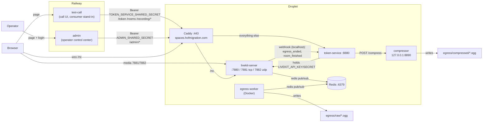

# Space: working rules for AI agents

Read this before changing anything in this repo.

**The stack in one line:** a self-hosted LiveKit video-calling stack — `livekit-server` (media),
`token-service` (TS/Fastify, the only holder of LiveKit credentials), `compressor` (JS/Fastify,
internal-only), Redis and a Dockerized LiveKit Egress worker for audio recording, all on one
DigitalOcean droplet behind Caddy — plus two small web apps deployed on Railway: `test-call` (the
Google-Meet-style call UI, a stand-in consumer) and `admin` (the permanent operator control center).

This repo is also infrastructure for a consumer app, `hof-petition-studio` (sibling repo, in the
parent `space-repos/` workspace) — it decides who may join which room and calls this repo's token
API; it never gets its own LiveKit credentials. Don't add anything Petition-Studio-specific here;
keep this repo generic so any future consumer can reuse it the same way. Don't edit anything inside
`hof-petition-studio/` from this repo's context — that repo owns its own `AGENTS.md`.

---

## Architecture

| Service | Lang | Runs on | Port | Holds | Purpose |
|---|---|---|---|---|---|
| `livekit-server` | Go binary | droplet | 7880 ws/http, 7881 tcp, 7882 udp | LiveKit key pair (runtime config) | Media server (SFU). Native, not Docker — see below. |
| `token-service` | TypeScript, Fastify | droplet | 8880 | LiveKit key pair, both bearer secrets | **Only** thing that mints tokens or talks to LiveKit's admin/egress API. Consumer routes + operator `/admin/*` routes. |
| `compressor` | JS, Fastify | droplet | 8890, bound `127.0.0.1` | nothing | Shrinks a finished recording via `ffmpeg`. Never LAN-reachable, so no auth. |
| Redis | — | droplet | 6379 | — | Job queue LiveKit server ↔ Egress worker use to coordinate. Recording-only; calling works without it. |
| Egress worker | Docker (`livekit/egress`) | droplet | — | LiveKit key pair (runtime config) | Joins a room as a hidden participant, records mixed audio to `egress/raw/`. |
| Caddy | — | droplet | 80/443 | Let's Encrypt cert | TLS for `spaces.hofmigration.com`: `/rtc` → LiveKit, `/twirp` + `/recording/webhook` blocked, everything else → token-service. |
| `test-call` | JS, Fastify | Railway (also local via `start-all.sh`) | `$PORT` (8888 locally) | `TOKEN_SERVICE_SHARED_SECRET` | Call UI + `/connect`/`/rooms`/`/whoami`/`/recording/*` proxies. Throwaway: simulates Petition Studio's path; delete once PS has its own call UI. |
| `admin` | JS, Fastify | Railway (manual `npm start` locally) | `$PORT` (8870 locally) | `ADMIN_SHARED_SECRET`, `ADMIN_PASSWORD` | Permanent operator control center: live rooms, remove/mute/close, start/stop recording, play/download/delete recordings, service health. |

## Security model

- `token-service` is the **only** thing in this repo (or any consumer) that ever holds real LiveKit
  credentials. Everything else gets a short-lived, room-scoped join token.
- **Two bearer secrets, checked in `token-service/src/auth.ts`:** `TOKEN_SERVICE_SHARED_SECRET` for
  consumer routes (`/token`, `/rooms`, `/participant`, `/recording/*`) — held by `test-call` and later
  Petition Studio's API; `ADMIN_SHARED_SECRET` for the operator-only `/admin/*` routes (remove people,
  close rooms, delete recordings) — held only by `admin`. Never give a consumer the admin secret; a
  leaked consumer secret must not be able to moderate or delete. Neither is a user-auth system —
  `token-service` has no concept of a logged-in person.
- **`admin` is the only login in the repo:** `ADMIN_PASSWORD`, a per-process HMAC-signed
  `HttpOnly; SameSite=Strict; Secure` session cookie (12 h), and 5-failures-per-15-min rate limiting by
  client IP. It runs with Fastify `trustProxy: true` because it's always behind Railway's edge; don't
  expose it directly or the IP-based rate limit becomes spoofable.
- **`test-call` has no login** — anyone with its URL can join rooms and press REC. That's accepted for
  a throwaway stand-in; Petition Studio will gate who joins which room.
- `compressor` has **no auth at all** — deliberately. It's bound to `127.0.0.1`, so nothing outside
  this host can reach it regardless. Don't add a shared secret to it; that would be solving a problem
  the bind address already solves.
- LiveKit webhooks are verified via `WebhookReceiver` (JWT in the `Authorization` header, signed with
  the LiveKit API secret) — see gotchas below for the header-name trap. LiveKit posts them to
  `localhost:8880`; Caddy answers `404` for `/recording/webhook` from outside.
- **Real credentials live only on the droplet.** The repo is public and its committed
  `devkey`/`secret` + `local-dev-secret-not-for-production` are LiveKit's/our published dev values.
  On Linux (not macOS, not Codespaces) `start-all.sh`'s `ensure_real_credentials` replaces them once
  with generated ones in the gitignored `token-service/.env` / `test-call/.env` (plus
  `ADMIN_SHARED_SECRET`), and `write_runtime_configs` renders `.runtime/livekit.yaml` and
  `.runtime/egress.yaml` with that key pair. The committed YAMLs keep only the dev pair — never put a
  real key in them.
- **Only `compressor` is loopback-bound.** `token-service` (8880), `livekit-server` (7880) and the
  Redis that `start-all.sh` launches (6379, `--bind 0.0.0.0 --protected-mode no`, no password) all
  listen on `0.0.0.0`. On the droplet the Cloud Firewall keeps them private and Caddy is the only
  public way in — see "Deployment". Redis must stay `0.0.0.0` (the Egress container reaches it over
  the Docker bridge, not loopback), so don't "fix" this by rebinding it to `127.0.0.1`.
- **`test-call` forwards only `/rtc` to LiveKit** (HTTP and WS upgrade). `/twirp` is LiveKit's admin
  API — never proxy it anywhere public; `token-service` reaches it on localhost.

## Why Egress is the only thing in Docker

Docker Desktop on macOS can't expose LiveKit's WebRTC UDP ports cleanly (no real host networking),
so `livekit-server` runs as the native binary. Egress doesn't need inbound WebRTC ports — it connects
*out* to the already-running server as a client — so running it in Docker while the server stays
native works fine, and Docker is genuinely required there since LiveKit only ships Egress as a Docker
image (no native binary like `livekit-server --dev`).

## Deployment

**Droplet:** DigitalOcean, Singapore (SGP1), 2 vCPU / 4 GB RAM, Ubuntu 24.04 x64, IPv4 only, SSH
alias `space-do`. Singapore was picked for the client base (Pakistan + UAE); Pakistan→India routing
is unreliable, so Bangalore was rejected. 4 GB is the floor with recording on — Egress runs headless
Chrome with `--shm-size=1g`; don't downsize to 2 GB. Public host: `spaces.hofmigration.com` (A record
at Bluehost, which hosts `hofmigration.com` DNS) → Caddy on the droplet.

**Railway:** `test-call` and `admin`, each a separate Railway service from this repo with its Root
Directory set to that folder (`npm start`). Both reach token-service at
`https://spaces.hofmigration.com` — the same path Petition Studio's API (also on Railway) will use.
`test-call` runs with `SPACE_HTTP=1` (Railway terminates TLS).

Firewall (DigitalOcean Cloud Firewall — it filters outside the droplet, so it can't block the
Egress container → host traffic the way host `ufw` can):

|Open to the internet|Keep closed|
|---|---|
|22/tcp SSH, 80/tcp + 443/tcp Caddy, 7881/tcp + 7882/udp LiveKit media|6379 Redis, 7880 LiveKit (browsers reach `/rtc` via Caddy), 8880 token-service (via Caddy), 8888 local test-call, 8890 compressor|

Railway's outbound IPs aren't static, so token-service can't be IP-allowlisted; the bearer secrets
over Caddy's HTTPS are the protection. Those are inbound rules. **Outbound stays DigitalOcean's
default allow-all (all TCP, all UDP, ICMP).** Don't tighten it: LiveKit sends media to each caller's
random high UDP/TCP port, so any outbound port allowlist silently breaks calls (people join and then
get no audio or video). `start-all.sh` also needs outbound 443 for apt, npm, Docker Hub, GitHub,
`get.livekit.io` and `api.ipify.org` (public-IP discovery), plus 53 for DNS.

Droplet-only settings in `token-service/.env` (gitignored): `LIVEKIT_PUBLIC_URL=wss://spaces.hofmigration.com`
(what `/token` returns as `serverUrl` — `test-call` passes any `wss://` value straight to the browser
and only falls back to its own `/rtc` proxy for the local `ws://` default) plus the generated key
pair and secrets. Caddy config lives in `/etc/caddy/Caddyfile` on the droplet (see README).

What `start-all.sh` does and doesn't do on a bare Linux host:

- **Does:** `apt-get` installs Redis/ffmpeg, installs `livekit-server`, generates real credentials
  once (see "Security model"), writes `.runtime/livekit.yaml` (key pair + `use_external_ip: true` +
  `node_ip: <public IPv4>` so ICE candidates are reachable) and `.runtime/egress.yaml`, and still
  starts a local `test-call` on 8888 (firewalled; handy for on-box debugging). `SPACE_PUBLIC_IP` /
  `SPACE_PUBLIC_HOST` override detection.
- **Doesn't:** install Node (need Node 20+ first — `ensure_npm_env` only runs `npm install`), install
  Docker (`curl -fsSL https://get.docker.com | sh`), install/configure Caddy, or daemonize — it runs in
  the foreground and Ctrl+C / SSH hangup stops everything, so run it inside `tmux` (session `space`).
  Ghostty's `TERM=xterm-ghostty` isn't known on the droplet: `TERM=xterm-256color tmux attach -t space`.
- **Host `ufw`:** if enabled with default-deny incoming, it also drops the Egress container's traffic
  to host Redis/LiveKit over `docker0`. It's inactive on the droplet; keep it that way, or
  `ufw allow from 172.17.0.0/16`.
- **Logs:** `/tmp/livekit.log`, `/tmp/token-service.log`, `/tmp/compressor.log`, `/tmp/redis.log`,
  `/tmp/start-all.log` (when run via `tee`), `docker logs space-egress`, `journalctl -u caddy`.
- **Harmless startup lines:** `could not validate external IP ... from 172.17.0.1:7882 ... context
  canceled` is LiveKit cancelling its parallel per-interface checks once one succeeded; only worry if
  no `using external IPs` line follows.

## Non-obvious gotchas (already hit, already fixed — don't rediscover these)

- **`livekit-server --dev` cannot sign egress webhooks.** Its placeholder-key mode has no
  `webhook.api_key`, so `StartRoomCompositeEgress`'s `webhooks` field silently fails
  (`"no signing key or secret was provided"` in the server log — the recording itself still starts,
  it just never notifies anyone when it's done). Recording requires the real
  `livekit/config.yaml`, not CLI flags. `start-all.sh` picks the config automatically when Redis is
  up and falls back to `--dev` (calling-only) when it isn't — don't revert that to a bare `--dev`.
- **LiveKit's webhook `Content-Type` is `application/webhook+json`**, not `application/json`.
  Fastify's default JSON parser won't touch it — you'll get a bare `415` with no other clue.
- **LiveKit's webhook auth header is the standard `Authorization`**, despite
  `livekit-server-sdk`'s own `WebhookReceiver.ts` exporting a constant named `authorizeHeader =
  'Authorize'`. That constant is misleading for this purpose; trust the wire behavior, not the name.
- **The Docker volume mount shifts the path by one segment.** `docker run -v egress:/out` means
  `/out/raw/<file>` on the container side is `egress/raw/<file>` on the host — *not*
  `egress/recordings/raw/<file>`. The container-path→host-path mapping lives in exactly one place:
  `token-service/src/livekit.ts`'s `containerPathToHostPath`. If you ever change the mount, that's
  the only function that needs to know.
- **RoomComposite egress requires the room to already exist.** You can't start recording a room
  before at least one participant has joined it — LiveKit rooms are created on first join, not
  pre-created. `POST /recording/start` on a room nobody's in yet 404s
  (`"requested room does not exist"`).
- **Audio-only billing only applies if `layout` and `customBaseUrl` are left unset** on the egress
  request. Setting either routes the recording through the video pipeline even with `audioOnly: true`.
- **Fastify's router wants wildcards on their own path segment.** Express's `app.all('/rtc*', …)`
  matches `/rtc`, `/rtcfoo`, `/rtc/anything` all at once; Fastify needs `/rtc` and `/rtc/*` registered
  separately (see `test-call/server.js`'s `forwardToLiveKit`).
- **The LiveKit WS-upgrade proxy deliberately bypasses `@fastify/http-proxy`.** That plugin's own
  docs call its `websocket` option "partial support." `test-call/server.js` instead hooks the plain
  `http-proxy` package straight onto `fastify.server` (the real Node server Fastify exposes) — same
  mechanism as the old Express version, just re-anchored. Don't "modernize" this to the Fastify-native
  plugin without re-verifying the WS path end-to-end (a raw `curl -i -N -H "Upgrade: websocket" …`
  handshake against `/rtc` returning `101 Switching Protocols` is the fastest way to check).
- **Identity is a per-browser `deviceId` (localStorage), not the typed display name.** Rejoining with
  the same identity evicts the earlier connection instead of adding a second participant — this is
  intentional (stops the same browser tab-duplicating into a room under two names) but means the
  duplicate-identity heartbeat (`/whoami`) and its 5s poll interval exist to force a *prompt* eviction,
  because LiveKit's own push-based disconnect to the losing side wasn't observed firing promptly in
  local testing.
- **The WS-upgrade proxy needs a client `socket.on('error')` listener.** Without it, a client
  resetting its socket after LiveKit rejects the upgrade (e.g. a bad token → `401`) is an unhandled
  `'error'` event that kills the whole `test-call` process — one bad request from anyone was enough.
- **The `--dev` fallback (no Redis) gets the real key pair via `LIVEKIT_KEYS`,** not `--keys` (that
  would show the secret in `ps`). `--dev` otherwise defaults to `devkey`/`secret`, which wouldn't
  match the generated keys token-service holds on the droplet.
- **`/admin/overview` fails per part, not all-or-nothing.** With the egress worker down, LiveKit's
  `listEgress` errors (`egress not connected (redis required)`); rooms and saved files still return,
  and the failing part is named in `errors`.

## Testing / verification notes

- There's no automated WebRTC end-to-end test, and headless-browser sandboxes (including this
  session's own browser tool) generally **cannot complete real ICE negotiation** — `room.connect()`
  will hang indefinitely rather than error. Don't burn time debugging that as if it were an app bug;
  verify the server/proxy/egress layers with the `lk` CLI instead
  (`lk room join --url ws://localhost:7880 --api-key devkey --api-secret secret --publish-demo
  <room>`, or `--publish <file>.ogg` for real audio content egress can actually record), and verify
  UI-only changes with forced DOM/class states in a screenshot rather than a live call.
- To sanity-check the WS proxy specifically without a browser: a raw curl WebSocket handshake against
  `/rtc?access_token=<token>` returning `101 Switching Protocols` plus LiveKit's binary join response
  proves the whole chain (Fastify → `http-proxy` → real server) end-to-end.
- `token-service` has real unit tests (`npm test`, Node's built-in test runner) for `mintToken` /
  `listActiveRooms` and `resolveRecordingFile` (the only gate between an admin-supplied filename and
  `fs.unlink`/reads — keep its traversal cases). `test-call`, `admin` and `compressor` don't have a
  test suite — they're thin enough that manual curl/`lk`-CLI/browser verification is the norm; don't
  add a test framework to them speculatively.
- On the droplet the `lk` CLI needs the generated pair, not `devkey`/`secret`:
  `--api-key "$(grep ^LIVEKIT_API_KEY= token-service/.env | cut -d= -f2)"` (same for the secret).

## Conventions

- `token-service` is TypeScript (it's the one with real logic and tests); `test-call`, `admin` and
  `compressor` are plain JS (small, mechanical, not worth a build step).
- All HTTP services use **Fastify**, not Express (migrated — see git history "Migrate token-service
  and test-call from Express to Fastify" for the full rationale if touching that layer).
- `devkey` / `secret` appearing everywhere (`.env.example`, `livekit/config.yaml`,
  `egress/config.yaml`) is LiveKit's own published fixed dev credential, not a real secret — fine to
  commit, fine to see in logs. Real values exist only in gitignored `.env` files / `.runtime/` on the
  droplet and in Railway service variables; never commit them or paste them into docs.
- `egress/raw/` and `egress/compressed/` are gitignored — never commit recordings, and don't remove
  the gitignore entries to "fix" an empty-looking directory.
- Multiple terminals/processes may already be running these services manually outside any single
  agent's process tree (local dev laptop *and* the shared droplet) — `ps aux` / `lsof -i :<port>`
  before assuming a port is free or a service isn't already up, and expect that restarting a service
  may interrupt someone else's live call.

## Where things live

- `token-service/src/livekit.ts` — all LiveKit SDK calls (tokens, rooms, participants, egress, path mapping).
- `token-service/src/index.ts` — consumer routes, including the `/recording/webhook` receiver.
- `token-service/src/admin.ts` — the operator `/admin/*` routes (overview, health, moderation, recording files with Range support).
- `token-service/src/recordings.ts` — recording directories, safe filename resolution, file listing.
- `token-service/src/auth.ts` — the two bearer-secret `preHandler`s.
- `test-call/server.js` — static files, CORS, LiveKit `/rtc` HTTP/WS proxy (local dev), `/connect`/`/rooms`/`/whoami`/`/recording/*` proxy routes.
- `test-call/public/index.html` — the entire call UI (single file: lobby, in-call layouts, controls).
- `admin/server.js` — login/session, rate limit, `/api/*` → token-service `/admin/*` proxy.
- `admin/public/index.html` — the entire control center UI (single file).
- `compressor/server.js` — the one `/compress` endpoint.
- `livekit/config.yaml`, `egress/config.yaml` — real (non-`--dev`) server config templates with the dev key pair; read the comments in each before editing.
- `start-all.sh` — local / Codespaces / VPS orchestration for the droplet side (plus a local
  `test-call`). Tries to install Redis / LiveKit / ffmpeg when they're missing. Degrades gracefully
  (calling still works) if Redis/Docker still aren't there. Codespaces and `SPACE_HTTP=1` stay on
  HTTP and let the upstream proxy terminate TLS; otherwise local `test-call` gets a self-signed cert.
  `/connect` honors `X-Forwarded-Proto` / `X-Forwarded-Host` so the browser gets `wss://` on the
  public host.
- `.runtime/` (gitignored, mode 700) — generated `livekit.yaml` / `egress.yaml` with the real key
  pair; never edit, edit the committed templates. Runtime logs: `/tmp/*.log` (see "Deployment").
- `README.md` — user-facing quick start (Codespaces, local setup, droplet + Caddy + Railway deploy, UI feature list). This file is agent-facing; keep the two in sync but don't duplicate wholesale.
