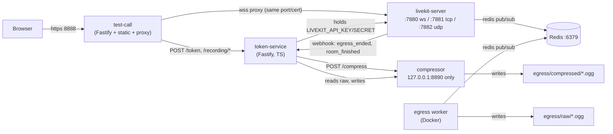

# Space: working rules for AI agents

Read this before changing anything in this repo.

**The stack in one line:** a self-hosted LiveKit video-calling stack — `livekit-server` (media),
`token-service` (TS/Fastify, the only holder of LiveKit credentials), `test-call` (JS/Fastify, the
Google-Meet-style call UI + reverse proxy), `compressor` (JS/Fastify, internal-only), plus Redis and
a Dockerized LiveKit Egress worker for audio recording. All five app services run natively on the
host except Egress, which must run in Docker (see "Why Egress is the only thing in Docker" below).

This repo is also infrastructure for a consumer app, `hof-petition-studio` (sibling repo, in the
parent `space-repos/` workspace) — it decides who may join which room and calls this repo's token
API; it never gets its own LiveKit credentials. Don't add anything Petition-Studio-specific here;
keep this repo generic so any future consumer can reuse it the same way. Don't edit anything inside
`hof-petition-studio/` from this repo's context — that repo owns its own `AGENTS.md`.

---

## Architecture

| Service | Lang | Port | Holds | Purpose |
|---|---|---|---|---|
| `livekit-server` | Go binary | 7880 ws/http, 7881 tcp, 7882 udp | `devkey`/`secret` | Media server (SFU). Native, not Docker — see below. |
| `token-service` | TypeScript, Fastify | 8880 | `LIVEKIT_API_KEY`/`SECRET` | **Only** thing that mints tokens or talks to LiveKit's admin/egress API. |
| `test-call` | JS, Fastify | 8888 (https), 8889 (wss fallback) | `TOKEN_SERVICE_SHARED_SECRET` | The actual call UI + static files + LiveKit signaling/HTTP proxy. |
| `compressor` | JS, Fastify | 8890, bound `127.0.0.1` | nothing | Shrinks a finished recording via `ffmpeg`. Never LAN-reachable, so no auth. |
| Redis | — | 6379 | — | Job queue LiveKit server ↔ Egress worker use to coordinate. Recording-only; calling works without it. |
| Egress worker | Docker (`livekit/egress`) | — | `devkey`/`secret` (own config) | Joins a room as a hidden participant, records mixed audio to `egress/raw/`. |

## Security model

- `token-service` is the **only** thing in this repo (or any consumer) that ever holds real LiveKit
  credentials. Everything else gets a short-lived, room-scoped join token.
- Service-to-service calls (`test-call` → `token-service`) use a shared secret
  (`TOKEN_SERVICE_SHARED_SECRET`), checked in `token-service/src/auth.ts`. Not a user-auth system —
  `token-service` has no concept of a logged-in person; the caller already decided who's allowed in.
- `compressor` has **no auth at all** — deliberately. It's bound to `127.0.0.1`, so nothing outside
  this host can reach it regardless. Don't add a shared secret to it; that would be solving a problem
  the bind address already solves.
- LiveKit webhooks are verified via `WebhookReceiver` (JWT in the `Authorization` header, signed with
  `devkey`'s secret) — see gotchas below for the header-name trap.

## Why Egress is the only thing in Docker

Docker Desktop on macOS can't expose LiveKit's WebRTC UDP ports cleanly (no real host networking),
so `livekit-server` runs as the native binary. Egress doesn't need inbound WebRTC ports — it connects
*out* to the already-running server as a client — so running it in Docker while the server stays
native works fine, and Docker is genuinely required there since LiveKit only ships Egress as a Docker
image (no native binary like `livekit-server --dev`).

## Non-obvious gotchas (already hit, already fixed — don't rediscover these)

- **`livekit-server --dev` cannot sign egress webhooks.** Its placeholder-key mode has no
  `webhook.api_key`, so `StartRoomCompositeEgress`'s `webhooks` field silently fails
  (`"no signing key or secret was provided"` in the server log — the recording itself still starts,
  it just never notifies anyone when it's done). Recording requires the real
  `livekit/config.yaml`, not CLI flags. `start-all.sh` picks the config automatically when Redis is
  up and falls back to `--dev` (calling-only) when it isn't — don't revert that to a bare `--dev`.
- **LiveKit's webhook `Content-Type` is `application/webhook+json`**, not `application/json`.
  Fastify's default JSON parser won't touch it — you'll get a bare `415` with no other clue.
- **LiveKit's webhook auth header is the standard `Authorization`**, despite
  `livekit-server-sdk`'s own `WebhookReceiver.ts` exporting a constant named `authorizeHeader =
  'Authorize'`. That constant is misleading for this purpose; trust the wire behavior, not the name.
- **The Docker volume mount shifts the path by one segment.** `docker run -v egress:/out` means
  `/out/raw/<file>` on the container side is `egress/raw/<file>` on the host — *not*
  `egress/recordings/raw/<file>`. The container-path→host-path mapping lives in exactly one place:
  `token-service/src/livekit.ts`'s `containerPathToHostPath`. If you ever change the mount, that's
  the only function that needs to know.
- **RoomComposite egress requires the room to already exist.** You can't start recording a room
  before at least one participant has joined it — LiveKit rooms are created on first join, not
  pre-created. `POST /recording/start` on a room nobody's in yet 404s
  (`"requested room does not exist"`).
- **Audio-only billing only applies if `layout` and `customBaseUrl` are left unset** on the egress
  request. Setting either routes the recording through the video pipeline even with `audioOnly: true`.
- **Fastify's router wants wildcards on their own path segment.** Express's `app.all('/rtc*', …)`
  matches `/rtc`, `/rtcfoo`, `/rtc/anything` all at once; Fastify needs `/rtc` and `/rtc/*` registered
  separately (see `test-call/server.js`'s `forwardToLiveKit`).
- **The LiveKit WS-upgrade proxy deliberately bypasses `@fastify/http-proxy`.** That plugin's own
  docs call its `websocket` option "partial support." `test-call/server.js` instead hooks the plain
  `http-proxy` package straight onto `fastify.server` (the real Node server Fastify exposes) — same
  mechanism as the old Express version, just re-anchored. Don't "modernize" this to the Fastify-native
  plugin without re-verifying the WS path end-to-end (a raw `curl -i -N -H "Upgrade: websocket" …`
  handshake against `/rtc` returning `101 Switching Protocols` is the fastest way to check).
- **Identity is a per-browser `deviceId` (localStorage), not the typed display name.** Rejoining with
  the same identity evicts the earlier connection instead of adding a second participant — this is
  intentional (stops the same browser tab-duplicating into a room under two names) but means the
  duplicate-identity heartbeat (`/whoami`) and its 5s poll interval exist to force a *prompt* eviction,
  because LiveKit's own push-based disconnect to the losing side wasn't observed firing promptly in
  local testing.

## Testing / verification notes

- There's no automated WebRTC end-to-end test, and headless-browser sandboxes (including this
  session's own browser tool) generally **cannot complete real ICE negotiation** — `room.connect()`
  will hang indefinitely rather than error. Don't burn time debugging that as if it were an app bug;
  verify the server/proxy/egress layers with the `lk` CLI instead
  (`lk room join --url ws://localhost:7880 --api-key devkey --api-secret secret --publish-demo
  <room>`, or `--publish <file>.ogg` for real audio content egress can actually record), and verify
  UI-only changes with forced DOM/class states in a screenshot rather than a live call.
- To sanity-check the WS proxy specifically without a browser: a raw curl WebSocket handshake against
  `/rtc?access_token=<token>` returning `101 Switching Protocols` plus LiveKit's binary join response
  proves the whole chain (Fastify → `http-proxy` → real server) end-to-end.
- `token-service` has real unit tests (`npm test`, Node's built-in test runner) for `mintToken` /
  `listActiveRooms`. `test-call` and `compressor` don't have a test suite — they're thin enough that
  manual curl/`lk`-CLI verification is the norm; don't add a test framework to them speculatively.

## Conventions

- `token-service` is TypeScript (it's the one with real logic and tests); `test-call` and
  `compressor` are plain JS (small, mechanical, not worth a build step).
- All HTTP services use **Fastify**, not Express (migrated — see git history "Migrate token-service
  and test-call from Express to Fastify" for the full rationale if touching that layer).
- `devkey` / `secret` appearing everywhere (`.env.example`, `livekit/config.yaml`,
  `egress/config.yaml`) is LiveKit's own published fixed dev credential, not a real secret — fine to
  commit, fine to see in logs. A real deployment needs real keys and a real
  `TOKEN_SERVICE_SHARED_SECRET`; don't reuse these past local dev.
- `egress/raw/` and `egress/compressed/` are gitignored — never commit recordings, and don't remove
  the gitignore entries to "fix" an empty-looking directory.
- Multiple terminals/processes may already be running these services manually outside any single
  agent's process tree (this is a hands-on local dev repo, not CI) — `ps aux` / `lsof -i :<port>`
  before assuming a port is free or a service isn't already up, and expect that restarting a service
  may interrupt someone else's live call.

## Where things live

- `token-service/src/livekit.ts` — all LiveKit SDK calls (tokens, rooms, egress, path mapping).
- `token-service/src/index.ts` — routes, including the `/recording/webhook` receiver.
- `token-service/src/auth.ts` — the shared-secret `preHandler`.
- `test-call/server.js` — static files, CORS, LiveKit HTTP/WS proxy, `/connect`/`/rooms`/`/whoami`/`/recording/*` proxy routes.
- `test-call/public/index.html` — the entire call UI (single file: lobby, in-call layouts, controls).
- `compressor/server.js` — the one `/compress` endpoint.
- `livekit/config.yaml`, `egress/config.yaml` — real (non-`--dev`) server config; read the comments in each before editing.
- `start-all.sh` — local orchestration; degrades gracefully (calling still works) if Redis/Docker are missing.
- `README.md` — user-facing quick start (Codespaces, local setup, UI feature list). This file is agent-facing; keep the two in sync but don't duplicate wholesale.
