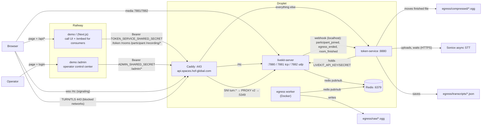

# Spaces: working rules for AI agents

Read this before changing anything in this repo. It holds facts and rules; the step-by-step
droplet procedures (deploy, safe restart, verify) are in the `spaces-droplet-ops` skill. The product
is called **Spaces** in the UI (`demo/components/ui/Logo.tsx`); the repo and paths still say `space`.

**The stack in one line:** a self-hosted LiveKit video-calling stack — `livekit-server` (media),
`token-service` (TS/Fastify, the only holder of LiveKit credentials), Redis and a Dockerized
LiveKit Egress worker for audio recording, all on one
DigitalOcean droplet behind Caddy — plus one Next.js 16 app on Railway, `demo`, serving the
LiveKit-React-components call UI (anonymous at `/`, token-only at `/embed` for consumer apps to
iframe) and the operator control center at `/admin`.

This repo is also infrastructure for a consumer app, `hof-petition-studio` (sibling repo, in the
parent `space-repos/` workspace) — it decides who may join which room and calls this repo's token
API; it never gets its own LiveKit credentials. Don't add anything Petition-Studio-specific here;
keep this repo generic so any future consumer can reuse it the same way. Don't edit anything inside
`hof-petition-studio/` from this repo's context — that repo owns its own `AGENTS.md`.

## Working here

- **The user edits and commits in parallel.** Run `git status --short` first, stage only the paths
  you changed (`git add <path>…`, or `git commit -m … -- <path>…` for tracked files), never
  `git add -A` / `commit -a`. Their uncommitted files are theirs; leave them alone.
- **Where a change goes live:** push to `main` → Railway rebuilds `demo` by itself (a few minutes).
  Droplet changes need `ssh space-do 'cd ~/space && git pull -q --ff-only'`. token-service runs
  under `tsx watch`, so a pull reloads it with no call impact (check `/tmp/token-service.log` shows a
  `Restarting...` after the pull: on 2026-09-29 the watcher stopped noticing changes and it took a
  `systemctl restart spaces`). Anything else (`start-all.sh`,
  `livekit/config.yaml`, `egress/config.yaml`, `.env`) needs `systemctl restart
  spaces`, which drops live calls: check for live rooms first and ask the user if anyone is in one.
  `/admin` → Settings → Restart Spaces does the same (`POST /admin/restart`: refused while anyone
  is in a room or a recording runs, then `systemctl --no-block restart spaces` after the reply).
- **Verify on the real surface:** `/root/tools/stack-check.sh` on the droplet (health, every
  service, a join over the public URL, a recording started on it through to its finished file and Soniox transcript); `puppeteer-core`
  scripts in `/tmp` for UI and calls (see "Testing"). `npm test` in `token-service`, `npm run build`
  in `demo`.
- **Record what shipped** in `CHANGELOG.md` (newest first, one line per user-visible change), and
  update this file when you learn a fact the next agent would otherwise rediscover. Delete facts
  that stop being true instead of adding a correction next to them.

---

## Architecture

```mermaid
graph LR
  subgraph Railway
    DM["demo / (Next.js)\ncall UI + /embed for consumers"]
    AD["demo /admin\noperator control center"]
  end
  subgraph Droplet
    CA["Caddy :443\napi.spaces.hof-global.com"]
    TS["token-service :8880"]
    LK["livekit-server\n:7880 / 7881 tcp / 7882 udp"]
    RD[(Redis :6379)]
    EG["egress worker\n(Docker)"]
  end
  Browser -->|page + /api/*| DM
  Operator -->|page + login| AD
  DM -->|"Bearer TOKEN_SERVICE_SHARED_SECRET\n/token /rooms /participant /recording/*"| CA
  AD -->|"Bearer ADMIN_SHARED_SECRET\n/admin/*"| CA
  Browser -->|"wss /rtc (signaling)"| CA
  Browser -->|"media 7881/7882"| LK
  Browser -->|"TURN/TLS 443 (blocked networks)"| CA
  CA -->|/rtc| LK
  CA -->|"SNI turn.* → PROXY v2 → :5349"| LK
  CA -->|everything else| TS
  TS -->|holds LIVEKIT_API_KEY/SECRET| LK
  LK -->|redis pub/sub| RD
  EG -->|redis pub/sub| RD
  EG -->|writes| RAW[egress/raw/*.ogg]
  LK -->|"webhook (localhost): participant_joined, egress_ended, room_finished"| TS
  TS -->|"moves finished file"| COMP[egress/compressed/*.ogg]
  TS -->|"uploads, waits (HTTPS)"| SX[Soniox async STT]
  TS -->|"saves"| TR[egress/transcripts/*.json]
```

| Service | Lang | Runs on | Port | Holds | Purpose |
|---|---|---|---|---|---|
| `livekit-server` | Go binary | droplet | 7880 ws/http, 7881 tcp, 7882 udp | LiveKit key pair (runtime config) | Media server (SFU). Native, not Docker — see below. |
| `token-service` | TypeScript, Fastify | droplet | 8880 | LiveKit key pair, both bearer secrets, `SONIOX_API_KEY` | **Only** thing that mints tokens or talks to LiveKit's admin/egress API. Consumer routes + operator `/admin/*` routes. Starts every call's recording and has Soniox transcribe every finished one. |
| Redis | — | droplet | 6379 | — | Job queue LiveKit server ↔ Egress worker use to coordinate. Recording-only; calling works without it. |
| Egress worker | Docker (`livekit/egress:v1.14.1`, pinned) | droplet | — | LiveKit key pair (runtime config) | Joins a room as a hidden participant, mixes everyone's audio and writes 24 kbps Opus to `egress/raw/`; token-service moves it to `egress/compressed/` when egress reports it finished. |
| Caddy | — | droplet | 80/443 | Let's Encrypt certs | TLS for `api.spaces.hof-global.com`: `/rtc` → LiveKit, `/twirp` + `/recording/webhook` blocked, everything else → token-service. Also, via the `layer4` plugin (custom build, see README), TURN/TLS for `turn.hof-global.com` → LiveKit's TURN on `127.0.0.1:5349`. Config: `deploy/Caddyfile`. |
| `demo` | TypeScript, Next.js 16, React 19, Node ≥ 22.22 (`livekit-client`'s `machina` requires it), `@livekit/components-react` | Railway `https://spaces.hof-global.com` (also local via `start-all.sh`) | `$PORT` (8888 locally) | `TOKEN_SERVICE_SHARED_SECRET`; plus `ADMIN_SHARED_SECRET` + `ADMIN_PASSWORD` for `/admin` | `/` + `/rooms/[room]`: full call UI (pre-join, grid/focus, chat, people, devices, background blur/virtual backgrounds, noise cancellation, reactions, raise hand, record, invite, reconnect banner). `/embed`: the same call UI, token-only, for consumer apps to iframe (see "Embed mode"). `/admin`: the permanent operator control center. Server routes under `app/api/*` and `app/admin/*` hold the secrets; the browser never sees them. |

## Security model

- `token-service` is the **only** thing in this repo (or any consumer) that ever holds real LiveKit
  credentials. Everything else gets a short-lived, room-scoped join token.
- **Two bearer secrets, checked in `token-service/src/auth.ts`:** `TOKEN_SERVICE_SHARED_SECRET` for
  consumer routes (`/token`, `/embed/session`, `/rooms`, `/participant`, `/recording/*`, `/room/end`, `/room/host`, `/room/mute|remove|spotlight`, `/lobby/*`) — held by `demo` and later
  Petition Studio's API; `ADMIN_SHARED_SECRET` for the operator-only `/admin/*` routes (remove people,
  close rooms, delete recordings) — held only by `demo`'s `/admin` server routes
  (`demo/lib/server/tokenService.ts`, `kind: 'admin'`). Never give a consumer the admin secret; a
  leaked consumer secret must not be able to moderate or delete. Neither is a user-auth system —
  `token-service` has no concept of a logged-in person.
- **Hosting is the consumer's decision; token-service only records and enforces it.** A room's
  hosts are a `hosts` list in its LiveKit metadata, not anything in the join token. `/token` with
  `host: true` adds the identity to it (`recordRoomHost`, creating the room if needed; `GET /rooms`
  reports `hosts`). `/room/host` lets a host make someone in the call a host or stop them hosting
  (never themselves, so a room can't lose its last host that way; someone demoted is admitted so
  they can rejoin past the waiting room). Every host action (`/room/end`, `/room/host`,
  `/room/mute|remove|spotlight`, `/lobby/pending|answer|settings`) takes the caller's own join token, verifies it (`tokenIdentity`;
  expired tokens accepted for 24 h, since calls outlive the 2 h TTL) and checks that identity is in
  `hosts` right now (`hostIdentity`), so a promotion or demotion takes effect with no new token.
  Clients read the same metadata to show who hosts (tamper-proof, unlike participant attributes).
  The demo's rule (`demo/app/api/connect/route.ts`): no recorded host, or you are in `hosts` → you
  host. Since demo identities are unauthenticated device ids, that's only as strong as the demo's
  join itself; a real consumer passes `host` from its own auth.
- **Host moderation** (`token-service/src/moderationRoutes.ts`, the row menu in People): pin someone
  for everyone (`spotlight` in the same room metadata; every client puts that person's screen share,
  else camera, on its stage when it changes, and anyone can still pin someone else for themselves),
  mute someone's mic (server-side `mutePublishedTrack`; they can unmute themselves; a `space.muted`
  data message to them alone shows "A host muted your mic"), and remove someone. A host removal
  blocks that identity from `/token` and `/lobby/ask` (403) until the room ends (`lobby.remove`, in
  memory); an admin removal still only revokes admission. Nobody moderates themselves, and a host
  can't remove another host (stop them hosting first). Every participant also gets "Pin for me" in
  that menu (local only, same as the tile's focus toggle).
- **The waiting room is enforced in token-service, not left to the consumer.** It's a
  `waitingRoom` flag in the same room metadata as `hosts` (set by a host on `/token` or
  `/lobby/settings`). With it on, `/token` for a non-host answers `409` unless a host already
  admitted that identity; the guest instead calls `/lobby/ask` and polls `/lobby/status`, which
  returns their join token once admitted. Listing, admitting, denying and switching it off
  (`/lobby/pending|answer|settings`) are host actions (see above).
  Requests live in token-service memory (`lobby.ts`): an asker that stops polling for 20 s is
  dropped, an unanswered one times out after 10 minutes (Meet's behaviour), and a restart forgets
  them all (waiting browsers just ask again). Admitted identities rejoin without asking until the
  room ends; an admin removal revokes that.
- **`/admin` is the only login in the repo** (`demo/lib/server/adminSession.ts`): `ADMIN_PASSWORD`,
  an HMAC-signed `HttpOnly; SameSite=Strict; Path=/admin` session cookie (12 h, `Secure` over HTTPS),
  and 5-failures-per-15-min rate limiting. The limit keys on `X-Forwarded-For` only when
  `TRUST_PROXY=1` (Railway); otherwise all clients share one bucket so nobody can spoof past it.
- **The admin lives inside the call-UI app by choice** (one Railway URL for both).
- **The anonymous call path (`/`, `/rooms/*`) has no login** — anyone with its URL can join rooms
  and press Record. Consumer apps use `/embed` instead, where a join token minted by the consumer
  decides the room, identity, name and host role (see "Embed mode").
- **Tokens grant `canUpdateOwnMetadata`** so a participant can set its own `hand` attribute (raise
  hand). It only covers the participant's own metadata/attributes.
- LiveKit webhooks are verified via `WebhookReceiver` (JWT in the `Authorization` header, signed with
  the LiveKit API secret) — see gotchas below for the header-name trap. LiveKit posts them to
  `localhost:8880`; Caddy answers `404` for `/recording/webhook` from outside.
- **Calls are recorded only on request; every recording is transcribed.** Someone presses Record
  (or `/admin` starts it). `RECORD_ALL_CALLS=1` records every call instead, and a consumer can ask
  for one call with `record: true` on `/token` (`markRoomRecorded`, a `record` flag in the room's
  metadata next to `hosts`): the first participant to join starts the room's recording
  (`autoRecord.ts`, on LiveKit's `participant_joined` webhook, which carries the room metadata; the
  egress participant itself is ignored), and once stopped by hand it stays off for that room until it
  closes (in memory). Each
  finished recording goes to Soniox's async API (`transcripts.ts`, `stt-async-v5`, speakers
  separated as "1", "2", …: the mix has no names) and the transcript is saved as
  `egress/transcripts/<recording>.json`; the upload and Soniox's copy are deleted as soon as it's
  done (`cleanup`). `TRANSCRIPTION_TRANSLATE_TO=en` (on on the droplet since 2026-09-29) adds
  Soniox's one-way translation: each segment spoken in another language gets a `translation`
  (paired per utterance with the SDK's `translateFromTranscript`; segments are then finer, and
  translated text is billed as output text). `SONIOX_API_KEY` lives only in the droplet's `token-service/.env`. Unset, nothing
  is transcribed and `/admin` says "Off". At start token-service transcribes any saved recording
  without a transcript or saved failure (backfill, and jobs a restart cut short; skipped while
  transcription is switched off in Settings). Deleting a
  recording in `/admin` deletes its transcript. Consumers read them with
  `GET /recording/transcripts?room=` and download a listed recording's audio with
  `GET /recording/file/<file>` (consumer secret; no filename header, the consumer names it).
  Processing is in Soniox's US region; `SONIOX_REGION=in|eu|jp`
  needs a regional project and key from Soniox support.
- **Recording/transcription settings can be changed from `/admin` → Settings, live**
  (`token-service/src/settings.ts`): transcription on/off, language hints, terms, translate-to,
  audio bitrate and record-every-call. `.env` (`TRANSCRIPTION_*`, `RECORDING_AUDIO_KBPS`,
  `RECORD_ALL_CALLS`) holds the defaults; a save writes `token-service/settings.json` (gitignored,
  mode 600), which wins over `.env` until "Reset to .env" deletes it. Readers call `getSettings()`
  each time, so a change applies to the next recording/transcript with no restart. So on the
  droplet, check that file before trusting `.env` for these values. Everything else in Settings is
  read-only (secrets only as set / not set; the call app's own values come from `demo`'s
  `/admin/config`), and `ADMIN_PASSWORD` stays a Railway variable by the user's choice.
- **Real credentials live only on the droplet and in Railway variables.** The repo is public and its
  committed `devkey`/`secret` + `local-dev-secret-not-for-production` are LiveKit's/our published dev
  values. On Linux (not macOS) `start-all.sh`'s `ensure_real_credentials` replaces
  them once with generated ones in the gitignored `token-service/.env` / `demo/.env` (plus
  `ADMIN_SHARED_SECRET`), and `write_runtime_configs` renders `.runtime/livekit.yaml` and
  `.runtime/egress.yaml` with that key pair. The committed YAMLs keep only the dev pair — never put a
  real key in them.
- **The droplet services listen on `0.0.0.0`:** `token-service` (8880), `livekit-server` (7880) and
  the Redis that `start-all.sh` launches (6379, `--bind 0.0.0.0 --protected-mode no`, no password).
  On the droplet the Cloud Firewall keeps them private and Caddy is the only
  public way in — see "Deployment". Redis must stay `0.0.0.0` (the Egress container reaches it over
  the Docker bridge, not loopback), so don't "fix" this by rebinding it to `127.0.0.1`.
- **Never expose `/twirp`** (LiveKit's admin API) publicly. Caddy blocks it; `token-service` reaches
  it on localhost. Browsers only ever need `/rtc`.
- **Rooms close themselves, and calls are capped.** `livekit/config.yaml`'s `room:` block sets the
  defaults for every room, including ones LiveKit auto-creates on first join: `empty_timeout: 300`
  (a room nobody joins), `departure_timeout: 40` (after the last person leaves — long enough to
  survive a reconnect; the recording and `room_finished` wait that long too) and
  `max_participants: 40`. On top of that `capacityFor()` (`livekit.ts`, checked in `/token` and when
  the waiting room admits someone) refuses a join with `503 {full: true}` past
  `MAX_PARTICIPANTS_PER_ROOM` or `MAX_PARTICIPANTS_TOTAL` (both 40) — the second has no LiveKit
  setting at all. Its counts come from `listRooms`, which lags real joins by about 3 s, so a
  simultaneous burst can overshoot the total slightly; the per-room number is exact because LiveKit
  enforces it too. Keep the two per-room numbers in step. Changing the YAML needs
  `systemctl restart spaces`; the env vars only need a pull.

## Embed mode

A consumer app iframes `/embed` instead of building its own call UI. It mints a join token with
token-service `POST /token` (consumer secret, `host: true|false`, optional `record: true` to record
the call from its first join; tokens live 2 h) and loads
`https://<demo>/embed?origin=<parent origin>#t=<token>` with
`allow="camera; microphone; display-capture; fullscreen; autoplay; clipboard-write"`.

- **Token in the fragment:** `#t=` is never sent to a server and is stripped from the URL on load.
  The page verifies it through `/api/embed/session` → token-service `POST /embed/session {token}`
  (consumer secret; `token-service/src/embedRoutes.ts`, `inspectJoinToken` in `livekit.ts`) →
  `{room, identity, name, serverUrl}`, 400 for a malformed body, 401 for a bad/expired token. The
  LiveKit URL comes from that verified session, never from the parent. Pre-join shows the name
  from the token, locked.
- **Framing:** `demo/proxy.ts` sets `Content-Security-Policy: frame-ancestors 'self'
  $EMBED_ALLOWED_ORIGINS` (comma-separated) on `/embed` only, read at request time. The bridge only
  talks when `?origin=` is in the same list.
- **What's different when embedded:** no invite/copy-link keys, no waiting room, only hosts see
  Record/Stop, no floating window (Document Picture-in-Picture is refused in iframes), and nobody
  can make or remove hosts — the consumer decides hosts through the token. Hosts can still pin for
  everyone, mute and remove.
- **Bridge `spaces-embed/1`** (postMessage, `demo/lib/embed.ts`, `EmbedBridge.tsx`). Spaces → parent:
  `ready`, `joined {room, identity}`, `left {reason}`, `recording {active}`,
  `screenshare {active, surface}`, `data {topic, payload, from, fromHost}`, and `expired` (the token
  got a 401 on load or Rejoin: mint a fresh token and remount the iframe). Parent → Spaces:
  `send {topic, payload, to: 'all'|'hosts'}`, relayed as LiveKit data. Topics must start with
  `app.` (the `space.*` topics are ours); the payload is JSON of at most 4096 bytes; `hosts` means
  the room's hosts minus the sender, and nothing is sent when that's empty.

## Why Egress is the only thing in Docker

Docker Desktop on macOS can't expose LiveKit's WebRTC UDP ports cleanly (no real host networking),
so `livekit-server` runs as the native binary. Egress doesn't need inbound WebRTC ports — it connects
*out* to the already-running server as a client — so running it in Docker while the server stays
native works fine, and Docker is genuinely required there since LiveKit only ships Egress as a Docker
image (no native binary like `livekit-server --dev`).

## Deployment

**Droplet:** DigitalOcean, Singapore (SGP1), 2 vCPU / 4 GB RAM, Ubuntu 24.04 x64, IPv4 only, SSH
alias `space-do`. Singapore was picked for the client base (Pakistan + UAE); Pakistan→India routing
is unreliable, so Bangalore was rejected. 4 GB is the floor with recording on — Egress runs headless
Chrome with `--shm-size=1g`; don't downsize to 2 GB. Hosts, all in the `hof-global.com` DNS at Wix:
`api.spaces` and `turn` are A records → the droplet's Caddy (token API + `/rtc`, and TURN);
`spaces` is a CNAME to Railway (the call app and `/admin`; verified by a `_railway-verify` TXT).
The old `spaces.hofmigration.com` / `turn.hofmigration.com` names were retired on 2026-09-29
(removed from Caddy; they no longer answer).

**Railway:** one service, `demo` (Root Directory `demo`; Railway runs `npm run build` then
`npm start`, and sets `PORT`), at `https://spaces.hof-global.com` (custom domain; the old
`https://spaces-demo.up.railway.app` still works). Variables:
`TOKEN_SERVICE_URL=https://api.spaces.hof-global.com`, `TOKEN_SERVICE_SHARED_SECRET`,
`ADMIN_SHARED_SECRET`, `ADMIN_PASSWORD`, `TRUST_PROXY=1`, `EMBED_ALLOWED_ORIGINS` (the consumer's
origin(s); unset = nothing but Spaces itself may frame `/embed`). It reaches token-service over the same
HTTPS path Petition Studio's API (also on Railway) will use.

Firewall (DigitalOcean Cloud Firewall — it filters outside the droplet, so it can't block the
Egress container → host traffic the way host `ufw` can):

|Open to the internet|Keep closed|
|---|---|
|22/tcp SSH, 80/tcp + 443/tcp Caddy, 7881/tcp + 7882/udp LiveKit media|6379 Redis, 7880 LiveKit (browsers reach `/rtc` via Caddy), 8880 token-service (via Caddy), 8888|

Railway's outbound IPs aren't static, so token-service can't be IP-allowlisted; the bearer secrets
over Caddy's HTTPS are the protection. Those are inbound rules. **Outbound stays DigitalOcean's
default allow-all (all TCP, all UDP, ICMP).** Don't tighten it: LiveKit sends media to each caller's
random high UDP/TCP port, so any outbound port allowlist silently breaks calls (people join and then
get no audio or video). `start-all.sh` also needs outbound 443 for apt, npm, Docker Hub, GitHub,
`get.livekit.io` and `api.ipify.org` (public-IP discovery), plus 53 for DNS.

Droplet-only settings in `token-service/.env` (gitignored): `LIVEKIT_PUBLIC_URL=wss://api.spaces.hof-global.com`
(what `/token` returns as `serverUrl`; the demo hands it straight to the browser),
`TURN_DOMAIN=turn.hof-global.com` (see TURN below), `SONIOX_API_KEY` (transcripts), plus the
generated key pair and secrets.
Caddy config is `deploy/Caddyfile` with the real hosts, installed as `/etc/caddy/Caddyfile`.

**TURN (relay for networks that only allow HTTPS):** LiveKit's built-in TURN, switched on by
`TURN_DOMAIN` (`start-all.sh` appends the `turn:` block to `.runtime/livekit.yaml`; needs
livekit-server 1.13.7+ for `proxy_protocol`, older versions get a warning and no TURN). LiveKit
always advertises `turns:<domain>:443` (hardcoded) but listens on `tls_port` 5349, so Caddy owns
443: its `layer4` listener wrapper matches the TURN host's SNI, terminates TLS with its own
Let's Encrypt cert (the `turn.hof-global.com { respond 404 }` site block exists only to get
that cert) and forwards plain TCP with a PROXY v2 header (`external_tls` + `proxy_protocol`).
Without the header TURN reports Caddy's `127.0.0.1` as the caller's address, which Firefox
rejects; with `proxy_protocol` on, connections without a header are refused. No UDP TURN: UDP 443
is Caddy's HTTP/3. Caddy is the `caddy-l4` build at `/usr/bin/caddy.custom`, chosen by
`update-alternatives` over the apt one (diverted to `/usr/bin/caddy.default`), so `apt upgrade`
doesn't overwrite it; update it with `caddy upgrade`, which keeps the plugin.
To prove TURN works, connect a real browser with `rtcConfig: { iceTransportPolicy: 'relay' }` (Chrome
needs a secure origin for the fake mic) and read `getStats()`: the transport's selected candidate
pair should have a `relay` local candidate with `relayProtocol: 'tls'` and url
`turns:turn.hof-global.com:443`, and audio `bytesSent` should grow. Callers don't need a separate
STUN server: with no UDP TURN port and no `rtc.stun_servers`, LiveKit hands browsers its default
public STUN list, and the SFU is reached on its own public `node_ip` anyway.

What `start-all.sh` does and doesn't do on a bare Linux host:

- **Does:** `apt-get` installs Redis, installs `livekit-server`, generates real credentials
  once (see "Security model"), writes `.runtime/livekit.yaml` (key pair + `use_external_ip: true` +
  `node_ip: <public IPv4>` so ICE candidates are reachable) and `.runtime/egress.yaml`.
  `SPACE_PUBLIC_IP` overrides IP detection. It does **not** start the demo on a VPS (Railway hosts it).
- **Doesn't:** install Node (need Node 20+ first — `ensure_npm_env` only runs `npm install`),
  install Docker (`curl -fsSL https://get.docker.com | sh`), or install/configure Caddy. It runs in
  the foreground and supervises: if LiveKit, token-service or its Redis exits, it
  stops the rest and exits 1.
- **On the droplet it runs under systemd as `spaces.service`** (`deploy/spaces.service`, symlinked
  into `/etc/systemd/system/`; install steps are in the unit's header). It starts on boot and
  restarts the whole stack 5 s after a service dies (`Restart=on-failure`; it gives up after 5
  failures in 5 minutes). Use `systemctl status|restart|stop spaces` and `journalctl -u spaces -f`;
  don't also run `start-all.sh` by hand there (two copies fight over the ports). The recording
  container has `--restart on-failure`, and Ubuntu's `redis-server.service` is disabled because
  `start-all.sh` runs its own Redis on 0.0.0.0 for the container. The tools on the droplet are
  `/root/tools/stack-check.sh` (full end-to-end check), `/root/tools/lk` (LiveKit CLI) and
  `/root/tools/turn-enable.sh` (the one-off TURN switch-on, already run).
- **Host `ufw`:** if enabled with default-deny incoming, it also drops the Egress container's traffic
  to host Redis/LiveKit over `docker0`. It's inactive on the droplet; keep it that way, or
  `ufw allow from 172.17.0.0/16`.
- **Logs:** `/tmp/livekit.log`, `/tmp/token-service.log`, `/tmp/redis.log`,
  `/tmp/demo.log` (local only), `journalctl -u spaces` (start-all's own output: which service died,
  restarts), `docker logs space-egress`, `journalctl -u caddy`.
- **Harmless startup lines:** `could not validate external IP ... from 172.17.0.1:7882 ... context
  canceled` is LiveKit cancelling its parallel per-interface checks once one succeeded; only worry if
  no `using external IPs` line follows.
- **Ubuntu auto-updates run in the quiet hours.** `unattended-upgrades` is on (security updates).
  Drop-ins in `/etc/systemd/system/apt-daily{,-upgrade}.timer.d/override.conf` move the list refresh
  to 21:00 UTC and the install to 22:00 UTC (03:00 PKT, 02:00 UAE), each +30 min random, instead of
  the stock 06:00 UTC (11:00 PKT). An install run takes 10+ minutes, pushes CPU to ~50–60%, and can
  restart `containerd`; a sudden CPU jump in `/admin` around then is that, not Spaces (`top`, look
  for `unattended-upgrade`, `apt-check`, `fwupd`, `packagekit`).
- **Reboots are safe:** `spaces.service` brings the whole stack back (verified: up about 10 s after
  boot, join and recording working). When an update leaves `/var/run/reboot-required` (kernel, libc),
  reboot in a quiet window; it still drops any live call for the ~30 s it takes.

Locally (macOS) the demo runs `next dev` on 8888 and the browser connects straight to
`ws://localhost:7880` (token-service's `LIVEKIT_URL`, since `LIVEKIT_PUBLIC_URL` is unset). That only
works from the same machine; test multi-device calls on the Railway deployment.

## Non-obvious gotchas (already hit, already fixed — don't rediscover these)

- **Recording webhooks come from `livekit/config.yaml`'s `webhook.urls`, not the egress request.**
  LiveKit sends every event there (token-service ignores what it doesn't use). Don't also pass
  `webhooks` to `StartRoomCompositeEgress`: each `egress_ended` would arrive twice. Changing the
  config needs `systemctl restart spaces`. `livekit-server --dev` has neither the URL nor a signing
  key (`webhook.api_key`), so under `--dev` recordings are never moved or transcribed and calls aren't
  auto-recorded. Recording requires the real `livekit/config.yaml`, not CLI flags. `start-all.sh`
  picks the config automatically when Redis is up and falls back to `--dev` (calling-only) when it
  isn't — don't revert that to a bare `--dev`.
- **The `--dev` fallback (no Redis) gets the real key pair via `LIVEKIT_KEYS`,** not `--keys` (that
  would show the secret in `ps`). `--dev` otherwise defaults to `devkey`/`secret`, which wouldn't
  match the generated keys token-service holds on the droplet.
- **LiveKit's webhook `Content-Type` is `application/webhook+json`**, not `application/json`.
  Fastify's default JSON parser won't touch it — you'll get a bare `415` with no other clue.
- **LiveKit's webhook auth header is the standard `Authorization`**, despite
  `livekit-server-sdk`'s own `WebhookReceiver.ts` exporting a constant named `authorizeHeader =
  'Authorize'`. That constant is misleading for this purpose; trust the wire behavior, not the name.
- **On Linux the egress container can't write to a root-owned `egress/raw`.** The `livekit/egress`
  image runs as uid 1001. Docker Desktop (macOS) ignores bind-mount permissions; a Linux VPS doesn't,
  so the recording goes `egress_active` → `egress_failed` with `Local upload failed: open
  /out/raw/<file>.ogg: permission denied` only when it's finalized. `start-all.sh` `chmod 0777`s
  `egress/raw` before starting the container; keep that.
- **The Docker volume mount shifts the path by one segment.** `docker run -v egress:/out` means
  `/out/raw/<file>` on the container side is `egress/raw/<file>` on the host — *not*
  `egress/recordings/raw/<file>`. The container-path→host-path mapping lives in exactly one place:
  `token-service/src/livekit.ts`'s `containerPathToHostPath`. If you ever change the mount, that's
  the only function that needs to know.
- **RoomComposite egress requires the room to already exist.** You can't start recording a room
  before at least one participant has joined it — LiveKit rooms are created on first join, not
  pre-created. `POST /recording/start` on a room nobody's in yet 404s
  (`"requested room does not exist"`).
- **Recording must stay on egress's audio-only pipeline (no Chrome).** An `audioOnly` room
  composite with `layout` and `customBaseUrl` unset runs on egress's SDK source (GStreamer mixing,
  `ShouldUseSDKSource` in egress's `pkg/config/pipeline.go`); setting either one starts headless
  Chrome. Measured on the droplet (2 vCPU): about 15% of one core per recording, the same at 24 kbps
  as at egress's 128 kbps default, so the bitrate is set on the request (`RECORDING_AUDIO_KBPS`, 24)
  instead of transcoding afterwards. A separate ffmpeg compressor used to do that second pass and
  pinned a core for about 86 s per recorded hour; it's gone, don't bring one back. For Opus, egress
  always mixes at 48 kHz stereo (`audioFrequency` is ignored). The image is pinned because this
  depends on egress's version: re-measure before bumping it.
- **Identity is a per-browser `deviceId` (localStorage), not the typed display name.** Rejoining with
  the same identity evicts the earlier connection instead of adding a second participant — this is
  intentional (stops the same browser tab-duplicating into a room under two names) but means the
  duplicate-identity heartbeat (`/api/whoami`) and its 5s poll exist to force a *prompt* eviction,
  because LiveKit's own push-based disconnect to the losing side wasn't observed firing promptly.
- **`/admin/overview` fails per part, not all-or-nothing.** With the egress worker down, LiveKit's
  `listEgress` errors (`egress not connected (redis required)`); rooms and saved files still return,
  and the failing part is named in `errors`. The same missing worker makes the call page's
  `/api/recording/status` 500 locally — expected without Docker; the UI treats it as "not recording".
- **Don't remount the Room.** The demo creates one `Room` per join in a `useState` initializer and
  connects through `useSequentialRoomConnectDisconnect` (`components/conference/Conference.tsx`);
  props/handlers passed into it (`onLeave`, `details`, `choices`) must be referentially stable or the
  effect reconnects — LiveKit's "don't remount LiveKitRoom" guidance.
- **LiveKit never clears a pin for someone who left.** `ParticipantTile` only clears it when the
  track's subscription drops (`handleSubscribe`), which doesn't happen on a disconnect, so the
  departed person's last frame held the stage (and the floating window) for good. `ConferenceLayout`
  clears the pin itself when the pinned identity is gone from `useParticipants`; keep that effect.
- **Never render a participant their own screen share.** `ConferenceLayout` drops the local
  `ScreenShare` track from `useTracks` before laying out and shows the `.share-banner` notice
  instead; the share key asks for `selfBrowserSurface: 'exclude'` (Chrome/Edge only, so the drop is
  what actually prevents the infinite tunnel) plus `surfaceSwitching: 'include'`. Others still get
  the share, and auto-focus only reacts to remote ones.
- **Every camera open costs a real camera about a second, so the pre-join must open it once.**
  LiveKit's `PreJoin` reopened it up to 4 extra times: `usePreviewTracks` recreates tracks when its
  `onError` prop changes identity (an inline arrow did that on every render); a first-visit camera
  is requested as `exact: 'default'` (no camera has that id, so it fails and retries); and each
  `MediaDeviceMenu` with an `initialSelection` calls `setDeviceId` on mount, which always restarts
  the device (the track holds `{exact: id}`, never equal to the plain id). `components/PreJoin.tsx`
  is `PreJoin`'s markup without those; keep its callbacks stable and its menus selection-free.
  Measure with a `getUserMedia` counter in the page (one call per visit is the target).
- **Noise cancellation is RNNoise, not DeepFilterNet3, not Krisp, not Voice isolation.** The mic
  always runs the browser's own echo cancellation, noise suppression and auto gain
  (`demo/lib/client/mic.ts`, used by `Conference` and `PreJoin`); LiveKit's `audioDefaults` turn on
  Chrome's `voiceIsolation`, which we force off. Settings → Microphone → Noise cancellation (off by
  default) only adds RNNoise (`@sapphi-red/web-noise-suppressor`, pinned 0.4.1) as the mic track's
  processor (`useNoiseFilter.ts`), in its own 48 kHz AudioContext because RNNoise assumes 48 kHz and
  LiveKit's context follows the device rate. Worklet + wasm (~150 KB) are copied into
  `demo/public/rnnoise/` (gitignored) by `demo/next.config.ts`. Measured locally (two browsers, speech
  plus pink noise): noise floor at the listener −48 → −66 dB, speech level unchanged, ~21 ms added
  delay over a plain Web Audio pass-through (itself ~21 ms), about +6% of one core. We dropped
  DeepFilterNet3 (lagged and chewed speech) and Krisp is LiveKit Cloud only; don't bring either back.
- **`supportsBackgroundProcessors()` creates a WebGL context per call.** Calling it on every render
  hit Chrome's context limit ("Too many active WebGL contexts") — check once (`useState`
  initializer in `useBackgroundEffect.ts`).
- **Some LiveKit components replace your `className` instead of merging it** (`Chat`,
  `MediaDeviceMenu`'s button). Style `Chat` via `.conference .lk-chat`, and pass `lk-button-menu`
  yourself on a `MediaDeviceMenu` you give a class to (that class draws its chevron).
- **Next bundles each route separately, so module-level state isn't shared between routes.** The
  admin session key is derived from `ADMIN_SHARED_SECRET` + `ADMIN_PASSWORD` (not random per module),
  and the login rate limit lives on `globalThis`.
- **Browser code that needs `window` (livekit-client, track processors) loads via
  `next/dynamic(..., { ssr: false })`** from a client component (`RoomClient.tsx`).
- **The production browser console is muted** (`demo/app/layout.tsx`, a `beforeInteractive`
  script that no-ops every `console` method before any library loads; `next dev` keeps it). Log on
  the server (route handlers), not in client code. To debug a deployed page:
  `localStorage.setItem('spaces-debug', '1')` and reload. Browser-native lines (failed requests,
  uncaught promise rejections, GPU warnings) still show, so client promises must be caught.
- **Don't call `setAttributes` before the room is connected.** An update sent during the join is
  never confirmed and livekit-client rejects it after 5 s (`SignalRequestError: Request to update
  local metadata timed out`); the attribute is lost. `ConferenceLayout` gates the mirror attribute
  on `ConnectionState.Connected`.
- **`livekit-server` drains on the first SIGTERM**: it keeps running (and holding 7880/7881/7882)
  until every participant leaves, so a replacement started right away just dies on the busy ports.
  A second SIGTERM forces it down. `systemctl restart spaces` doesn't wait for the drain: start-all's
  `cleanup` sends one SIGTERM, then systemd kills what's left (`KillMode=mixed`).
- **Video is never paused for bandwidth (user decision).** The SFU's congestion control
  steps video down per subscriber and never throttles audio, but `allow_pause` stays off
  (`livekit/config.yaml`), so it never pauses video outright. Uplink: the SDK sends the mic at priority
  `high`; `Conference.tsx` marks the camera `very-low` (Chrome takes a sender's priority from
  `encodings[0]`, so the SDK only sets that one) with a 540p top layer. Don't bring back the camera auto-pause on Poor quality (the removed `useAudioFirst`).

## Testing / verification notes

- There's no automated WebRTC end-to-end suite. Real two-browser calls **do** work locally with
  `puppeteer-core` driving Chrome for Testing (`~/.cache/puppeteer/chrome/...`) launched with
  `--use-fake-device-for-media-stream --use-fake-ui-for-media-stream`, one `browser.createBrowserContext()`
  per participant (separate localStorage → separate identities). Keep such scripts throwaway (e.g.
  `/tmp`), not in the repo. The omp browser tool's screenshots hung here once (Sept 2026); use
  puppeteer for scripted runs and `bsk` when you need the user's logged-in Chrome (Railway,
  Wix DNS, GitHub settings).
- Chrome's `--use-file-for-fake-audio-capture=<wav>` delivers silence on macOS unless the audio service
  sandbox is off: add `--disable-features=AudioServiceSandbox,AudioServiceOutOfProcess`. To compare
  audio, read the listener's `inbound-rtp` `audioLevel` from `getStats()` (wrap `RTCPeerConnection` in
  `evaluateOnNewDocument` to get the peer connections).
- LiveKit's Chat panel stays mounted while hidden (`display: none`): wait for
  `.lk-chat-form-input` to be **visible** before typing, or keystrokes are silently lost.
- The floating window (`FloatingWindow.tsx`) can be driven from puppeteer: click More → Floating
  window for a real user gesture, then reach its DOM through `window.documentPictureInPicture.window`.
  The automatic open on tab switch can't: Chrome never fires `enterpictureinpicture` for a CDP
  `bringToFront` tab switch (Google's own video-conferencing sample doesn't open either), so check
  that path by hand in a real Chrome (camera or mic on, then switch tabs).
- Verify the server/egress layers with the `lk` CLI (`lk room join --url ws://localhost:7880
  --api-key devkey --api-secret secret --publish-demo <room>`, or `--publish <file>.ogg` for real
  audio content egress can record). On the droplet the CLI needs the generated pair:
  `--api-key "$(grep ^LIVEKIT_API_KEY= token-service/.env | cut -d= -f2)"` (same for the secret).
- A raw WebSocket handshake against `https://api.spaces.hof-global.com/rtc?access_token=<token>` returning
  `101 Switching Protocols` proves Caddy → LiveKit signaling end-to-end.
- `token-service` has real unit tests (`npm test`, Node's built-in test runner) for `mintToken` /
  `listActiveRooms` and `resolveRecordingFile` (the only gate between an admin-supplied filename and
  `fs.unlink`/reads — keep its traversal cases). `demo` has no test suite; verify
  with `npm run build` (typecheck) plus a browser run. Don't add a test framework speculatively.

## Conventions

- `token-service` and `demo` are TypeScript.
- Droplet HTTP services use **Fastify**, not Express. The demo is **Next.js 16 App Router**: route
  handlers in `app/**/route.ts`, async `params`, `PageProps`/`RouteContext` generated types (run
  `npx next typegen` or a build before `tsc`). Read `demo/node_modules/next/dist/docs/` before using
  an unfamiliar Next API — `demo/AGENTS.md` is Next's own generated notice to that effect.
- Call UI uses **LiveKit's components and hooks** for anything they cover (useTrackToggle,
  MediaDeviceMenu/Select, ParticipantTile children, Chat, PreJoin, GridLayout/FocusLayout, useTracks,
  useParticipants, useDataChannel, useParticipantAttribute). The **look is Space's own**: a
  "conference speakerphone" system in `demo/app/globals.css`. It uses warm graphite surfaces, and its
  colors come only from signal lights (green = live, red = muted/recording/destructive, amber =
  attention). A recessed mono "status screen" (`Readout`) shows facts. Fonts are Hanken Grotesk +
  JetBrains Mono (`next/font`), and icons come from `lucide-react`. `@livekit/components-styles`
  stays underneath for layout mechanics, with its `--lk-*` theme variables remapped to Space tokens.
  Tokens, components and breakpoints are in `DESIGN.md`; users and principles in `PRODUCT.md`.
- `devkey` / `secret` appearing everywhere (`.env.example`, `livekit/config.yaml`,
  `egress/config.yaml`) is LiveKit's own published fixed dev credential, not a real secret — fine to
  commit, fine to see in logs. Real values exist only in gitignored `.env` files / `.runtime/` on the
  droplet and in Railway service variables; never commit them or paste them into docs.
- `egress/raw/`, `egress/compressed/` and `egress/transcripts/` are gitignored — never commit recordings or transcripts, and don't remove
  the gitignore entries to "fix" an empty-looking directory.
- Multiple terminals/processes may already be running these services manually outside any single
  agent's process tree (local dev laptop *and* the shared droplet) — `ps aux` / `lsof -i :<port>`
  before assuming a port is free or a service isn't already up, and expect that restarting a service
  may interrupt someone else's live call. Prefer spare ports (17880/18880/18888) for throwaway local
  test stacks.

## Where things live

- `token-service/src/livekit.ts` — all LiveKit SDK calls (tokens, rooms, participants, egress, path mapping).
- `token-service/src/index.ts` — consumer routes, including the `/recording/webhook` receiver (LiveKit's events: auto-record, finish + transcribe, room cleanup) and `/recording/transcripts`.
- `token-service/src/autoRecord.ts` — records a call from its first join (every call, or rooms marked on `/token`); remembers rooms someone stopped by hand.
- `token-service/src/settings.ts` — recording/transcription settings: `.env` defaults, `/admin` overrides in `token-service/settings.json`, validation (unit-tested).
- `token-service/src/transcripts.ts` — Soniox transcription of finished recordings, transcript files/status, plain-text rendering, startup backfill.
- `token-service/src/lobby.ts` + `lobbyRoutes.ts` — the waiting room: in-memory join requests (unit-tested) and the `/lobby/*` routes; a data message on topic `space.lobby` tells the host's client to refetch. `lobby.ts` also remembers who a host removed.
- `token-service/src/moderationRoutes.ts` — `/room/mute`, `/room/remove`, `/room/spotlight` (host moderation); demo relay `demo/app/api/moderate/[action]`.
- `token-service/src/admin.ts` — the operator `/admin/*` routes (overview, health, system metrics, moderation, recording files with Range support, settings, restart).
- `token-service/src/system.ts` — `GET /admin/system`: host CPU/memory/network, per-service process rows, versions, TLS expiry, deployed commit. Linux-only parts return null on macOS; rates are deltas between calls (first call after a restart has nulls). It runs on every console poll, so keep it cheap; the comments explain why it reads cgroup files instead of `docker stats`.
- `token-service/src/recordings.ts` — recording directories, safe filename resolution, file listing, `finishRecording` (webhook: raw/ → compressed/).
- `token-service/src/embedRoutes.ts` — `POST /embed/session`: verifies a join token for `/embed`.
- `token-service/src/auth.ts` — the two bearer-secret `preHandler`s.
- `demo/app/api/*` — call-page server routes (`connect`, `rooms`, `rooms/status` (pre-join: occupancy, would-you-host, waiting room), `rooms/end`, `rooms/host`, `lobby/status` (guest poll), `lobby/[action]` (host), `whoami`, `recording/{start,stop,status}`) → token-service consumer routes.
- `demo/app/admin/*` — `/admin` page + `login`/`logout`/`session` routes + `api/[...path]` streaming proxy → token-service `/admin/*`.
- `demo/lib/server/tokenService.ts` — the only token-service client (both secrets); `demo/lib/server/adminSession.ts` — admin cookie + rate limit.
- `demo/components/RoomClient.tsx` — pre-join (`PreJoin.tsx`, LiveKit's `PreJoin` markup with one camera open; the name field is controlled, prefilled with the last-used name, and Join is never disabled for an empty-looking field: submit reads the field itself, because autofill or restored form state can show a value React never heard about; the would-be host gets the waiting-room switch) → `WaitingScreen` if the room has a waiting room → join → end screen (with a duration/people summary).
- `demo/components/conference/*` — `Conference` (Room lifecycle, audio-first publish defaults, duplicate-identity heartbeat, end-for-everyone, the end-screen summary), `ConferenceLayout` (VideoConference prefab expanded; one side panel at a time; tells you when you become or stop being a host), `useHosts` (room settings from metadata: who hosts, make/remove host), `Dock` (status readout · media · talk · more · Leave), `LeaveDialog` (leave confirmation for everyone; hosts also get end-for-everyone), `Tile`, `SidePanel`, `ParticipantsPanel` (hosts: waiting-room switch + requests, make/remove host per row), `SettingsPanel` + `useBackgroundEffect` + `useNoiseFilter`, `useWeakConnection` (reports a weak link to the dock), `ChatToasts` (the notification stack: chat, joins, plus the host's `WaitingNotice` and the alone card), `useWaitingRoom` (host side), `useReactions`, `useRecording`.
- `demo/components/conference/FloatingWindow.tsx` — the floating window: `useFloatingWindow` (Document Picture-in-Picture, opened by Chrome's `enterpictureinpicture` media-session action on tab switch or by More → Floating window; copies our stylesheets into the new window), `floatingTracks` (what it shows: the pinned track alone, else up to four remote cameras loudest-recent first with a `+N` chip, else your own when you're alone) and `FloatingCall` (that grid edge to edge, status chip, self-view, and a mic/camera/two-step-Leave pill that sleeps after 2.5 s idle), portaled into that window from `ConferenceLayout` so it shares the call's React tree and Room. Its keys reuse `Dock`'s `DeviceKey`, `elapsed` and `useSecondTick`.
- `demo/components/conference/useIsPhone.ts` — `matchMedia('(max-width: 560px)')`, the same breakpoint as the phone layout in `globals.css`. `ConferenceLayout` uses it to pull the local camera out of the grid into the `.self-view` thumbnail (tap = pin yourself). Keep the two breakpoints in step.
- `demo/proxy.ts` — `frame-ancestors` CSP on `/embed` from `EMBED_ALLOWED_ORIGINS`.
- `demo/lib/embed.ts` — `spaces-embed/1` protocol types, allowed-origin parsing, message validators.
- `demo/app/embed/page.tsx` + `demo/app/api/embed/session/route.ts` — the `/embed` page and its token-check relay to token-service `/embed/session`.
- `demo/components/embed/*` — `EmbedContext` (`EmbedContext.Provider`, supplied by `EmbedClient`, / `useEmbed()`, non-null when embedded), `EmbedClient` (fragment token → session → pre-join → call → end), `EmbedBridge` (room events → parent; parent `send` → LiveKit data).
- `demo/components/ui/*` — `Menu` (dock popover), `Device` (wordmark, LED, readout, initials), `SwitchRow`.
- `demo/components/admin/AdminDashboard.tsx` — the control center UI (Overview / Settings pill tabs; `#settings` opens Settings); `ServerPanel.tsx` (Server section: metric strips + processes table); `SettingsPanel.tsx` (Settings tab); `api.ts` (the `/admin/api` fetch helper); `format.ts` (bytes, rates, durations). `demo/app/admin/config` — the call app's own deployment values for Settings (read-only).
- `demo/public/backgrounds/*.webp` — virtual-background images (1920×1080, WebP q80); `thumbs/*.webp` are the 320 px settings-tile previews. Add a background as both.
- `demo/public/mediapipe/` — `selfie_segmenter.tflite` (committed, pinned float16 v1) and `wasm/` (gitignored, copied from node_modules by `demo/next.config.ts`): background effects load these from our origin, not jsdelivr/googleapis. `demo/public/rnnoise/` (gitignored, same copy step) holds the noise-cancellation worklet and wasm.
- `livekit/config.yaml`, `egress/config.yaml` — real (non-`--dev`) server config templates with the dev key pair; read the comments in each before editing.
- `deploy/spaces.service` (systemd unit running `start-all.sh`), `deploy/Caddyfile` (site + TURN SNI route, example hosts).
- `start-all.sh` — local (macOS) / VPS orchestration for the droplet side, plus `next dev` for
  the demo when not on a VPS. Tries to install Redis / LiveKit when they're missing.
  Degrades gracefully (calling still works) if Redis/Docker still aren't there.
- `.runtime/` (gitignored, mode 700) — generated `livekit.yaml` / `egress.yaml` with the real key
  pair; never edit, edit the committed templates. Runtime logs: `/tmp/*.log` (see "Deployment").
- `README.md` — user-facing quick start (local setup, droplet + Caddy + Railway deploy, UI feature list). This file is agent-facing; keep the two in sync but don't duplicate wholesale.
- `CHANGELOG.md` — what shipped, newest first. `DESIGN.md` / `PRODUCT.md` — the UI system and product context (the `impeccable` skill reads them).
